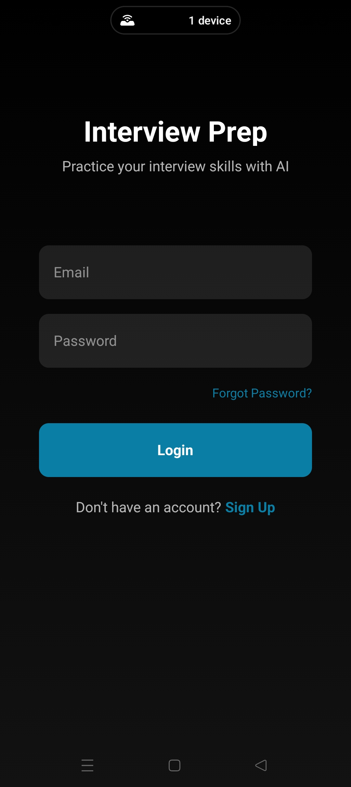
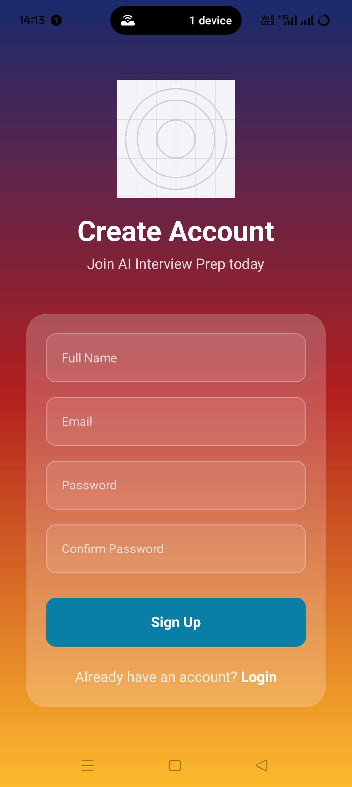
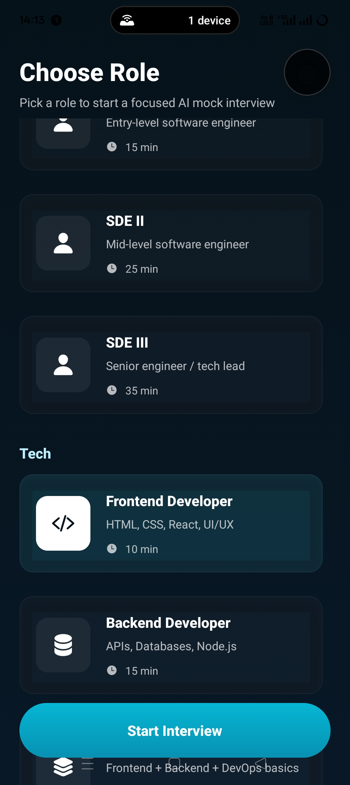
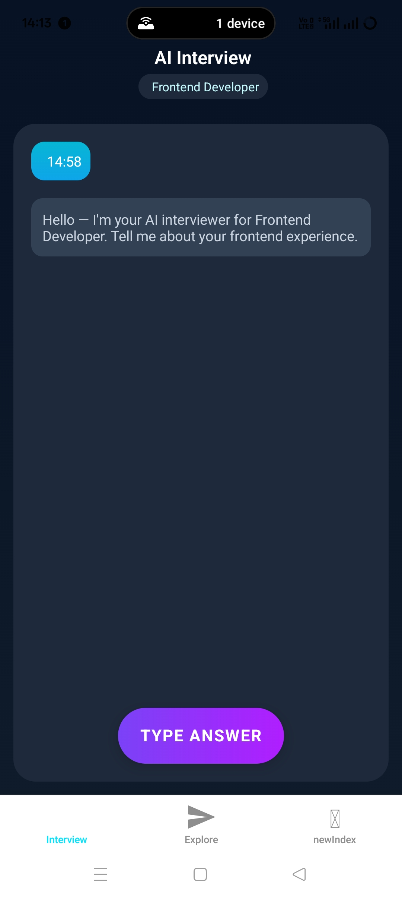

# 📝 Preparation-For-Interview-AI

[](https://github.com/Siddharthkothiyal/Preparation-For-Interview-AI/stargazers)  
[](https://github.com/Siddharthkothiyal/Preparation-For-Interview-AI/issues)  
[](https://github.com/Siddharthkothiyal/Preparation-For-Interview-AI/commits/main)  
[](https://github.com/Siddharthkothiyal/Preparation-For-Interview-AI/graphs/contributors)  

**AI-powered platform to help users prepare for job interviews with interactive mock interviews, AI-generated questions, and instant feedback.**

---

## 🚀 Key Features

- **Job Description Parsing** – AI generates interview questions tailored to any job description.  
- **Interactive Mock Interviews** – Practice interviews as if in a real scenario.  
- **Real-Time Feedback** – Detailed insights on strengths and areas for improvement.  
- **Voice & Text Interaction** – Answer questions by typing or speaking.  
- **Role-Based Experience** – Supports different user roles (Candidate / Interviewer).  
- **Progress Tracking** – Monitor improvement over multiple sessions.  

---

## 📸 Screenshots & Walkthrough

### **1️⃣ Login Page**
<p align="center">
  
</p>
Secure login interface for returning users. Includes email/password authentication and validation.

### **2️⃣ Signup Page**
<p align="center">
  
</p>
Signup page for new users with smooth onboarding experience and account creation.

### **3️⃣ Role Selection Page**
<p align="center">
  
</p>
Users select their role (Candidate or Interviewer) to access role-specific features.

### **4️⃣ Home / Job Description Input**
<p align="center">
  
</p>
Dashboard where candidates input job descriptions. AI parses and generates tailored interview questions.

### **5️⃣ Interview Simulation**
<p align="center">
  
</p>
Interactive interview screen with typing or voice input. Simulates real interview experience.

> ⚠️ Replace these image paths with your actual exported Figma screenshots in `assets/screenshots/`.

---

## 🛠️ Tech Stack

- **Frontend:** React Native (Expo)  
- **Backend:** Node.js + Express  
- **AI Integration:** OpenAI GPT-3  
- **Voice Interaction:** Web Speech API  
- **Database & Storage:** Firebase  

---

## ⚙️ Installation

### Prerequisites

- Node.js (v14+)  
- Expo CLI  
- Firebase account  

### Setup Steps

1. Clone the repository:

```bash
git clone https://github.com/Siddharthkothiyal/Preparation-For-Interview-AI.git
cd Preparation-For-Interview-AI
